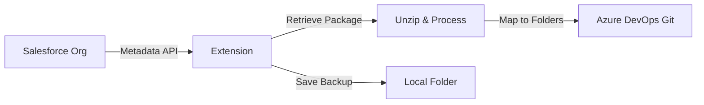

# Salesforce to Azure DevOps Connector

A Chrome/Edge browser extension that automates syncing Salesforce metadata to Azure DevOps Git repositories.

## Features

- 🔄 **Automated Sync**: Retrieve metadata from Salesforce and push to Azure DevOps
- 🗂️ **Custom Path Mapping**: Configure folder paths for different metadata types
- 🌐 **Multi-Org Support**: Switch between multiple Salesforce organizations
- 💾 **Local Backup**: Save backups to a custom local folder (File System Access API)
- 📦 **Package.xml Management**: Flexible package.xml path configuration
- 🧪 **Test Class Detection**: Automatic identification and tracking of test classes
- 🔁 **Retry Logic**: Built-in retry for handling concurrent Git operations
- 🔗 **Full Page Mode**: Open extension in a dedicated tab for better workflow

## Installation

### From Source (This Repository)

1. **Clone the repository:**
   ```bash
   git clone <your-repo-url>
   cd harmonic-curiosity
   ```

2. **Load in Chrome/Edge:**
   - Open `chrome://extensions/` (or `edge://extensions/`)
   - Enable **Developer Mode** (toggle in top-right)
   - Click **Load Unpacked**
   - Select the cloned `harmonic-curiosity` folder

3. **Verify installation:**
   - Extension icon should appear in toolbar
   - Click icon to open popup

## Prerequisites

- **Salesforce Account** with API access
- **Azure DevOps Account** with Git repository
- **Personal Access Token (PAT)** from Azure DevOps with:
  - Code (Read & Write)
  - Code (Status)

## Configuration

### 1. Azure DevOps Setup

1. Click the extension icon
2. In **Azure DevOps Configuration**:
   - **Paste Repo URL** and click **Fill** (auto-populates fields)
   - Or manually enter:
     - Organization
     - Project
     - Repository Name
     - Personal Access Token (PAT)
   - Optional: Git Username & Email for commit authorship

### 2. Salesforce Connection

1. Open any Salesforce org in a browser tab
2. Click **Reconnect** in the extension
3. If multiple orgs are open, select the target org

### 3. Backup Folder (Optional)

1. In **Backup Folder** section:
   - Click **Select Folder**
   - Choose a local folder (e.g., OneDrive, Dropbox)
   - Backups will now save there instead of Downloads

### 4. Sync Options

Configure:
- **Source Branch**: Branch to use as base (default: `main`)
- **Target Branch**: Branch to create/update
- **Commit Message**: Custom message for commits
- **Target Path Prefix**: Base folder path in ADO (e.g., `force-app/main/default`)
- **Test Class List Path**: File path to save test class names
- **Configure Paths by Type**: Map specific metadata types to custom folders

### 5. Package.xml Setup

- **Path**: Where to save package.xml in ADO (default: `manifest/package.xml`)
- **Content**: Paste or type your package.xml

## Usage

### Basic Sync Workflow

1. **Configure** all required fields
2. Click **"Save Config"** (saves settings for next time)
3. Click **"Sync to ADO"**
4. Monitor status messages:
   - Connecting to Salesforce
   - Retrieving metadata
   - Downloading backup
   - Checking ADO branch
   - Pushing changes
5. **Success!** Check your Azure DevOps repository

### Advanced Features

#### Path Mapping by Type
- Click **"Configure Paths by Type"** button
- Opens new tab with metadata type mappings
- Set custom ADO paths for each Salesforce metadata type
- Example: Map `ApexClass` → `force-app/main/default/classes`

#### Full Page Mode
- Click **"Open in Full Page"** for dedicated tab experience
- Useful for larger screens or extended work sessions

#### Branch Management
- Click **"Show Available Branches"** to list all ADO branches
- Helps verify branch names before syncing

## How It Works



1. **Retrieve**: Uses Salesforce Metadata API to retrieve package
2. **Process**: Unzips, identifies test classes, maps paths
3. **Sync**: Creates/updates branch in Azure DevOps
4. **Backup**: Saves ZIP locally (to selected folder or Downloads)

## File Structure

```
harmonic-curiosity/
├── manifest.json          # Extension configuration
├── background.js          # Service worker
├── icons/                 # Extension icons
│   ├── 16.png
│   ├── 48.png
│   └── 128.png
├── popup/                 # Main UI
│   ├── popup.html
│   ├── popup.js
│   ├── popup.css
│   ├── mappings.html      # Path configuration page
│   └── mappings.js
└── lib/                   # Core libraries
    ├── salesforce.js      # Salesforce API integration
    ├── ado.js            # Azure DevOps API integration
    ├── utils.js          # Utility functions
    └── jszip.min.js      # ZIP handling
```

## Troubleshooting

### "No open Salesforce tabs found"
- Open your Salesforce org in a browser tab
- Click **Reconnect** in extension
- Ensure you've granted permissions to `*.salesforce.com` and `*.force.com`

### "Failed to push: TF401028"
- Extension automatically retries (up to 2 times)
- This error occurs with concurrent Git operations
- If persists, check ADO repository health

### "Permission denied" (Backup Folder)
- Click **Clear** and re-select folder
- Ensure folder still exists and is accessible

### Sync Failures
1. Verify PAT has correct permissions
2. Check branch names are valid
3. Ensure Salesforce session is active
4. Review browser console for detailed errors

## Security Notes

- **PAT Storage**: Stored locally in `chrome.storage.local` (not synced across devices)
- **Session Handling**: Salesforce session captured from active tab cookies
- **Network**: All API calls are direct (extension → Salesforce, extension → ADO)
- **No Data Collection**: Extension does not send data to external servers

## Browser Compatibility

| Feature | Chrome | Edge | Firefox | Safari |
|---------|--------|------|---------|--------|
| Core Sync | ✅ | ✅ | ⚠️ | ❌ |
| Local Folder Backup | ✅ | ✅ | ❌ | ❌ |
| Multi-Org Switching | ✅ | ✅ | ⚠️ | ❌ |

✅ Full support | ⚠️ Partial support | ❌ Not supported

## Contributing

Issues and pull requests are welcome! Please ensure:
- Code follows existing style
- Test changes in both popup and full-page modes
- Update README for new features

## License

MIT License - See LICENSE file for details

## Author

**Purnachandar Padishala**  
Email: purna.padishala@gmail.com

## Changelog

### v1.0.0 (Current)
- Initial release
- Salesforce to ADO sync
- Multi-org support
- Local folder backup
- Custom path mapping
- Test class detection
- Retry logic for concurrent operations
